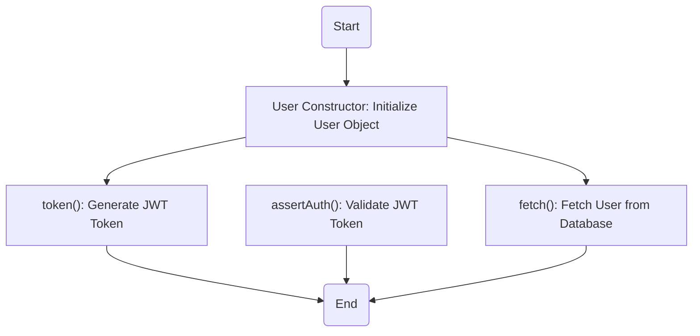
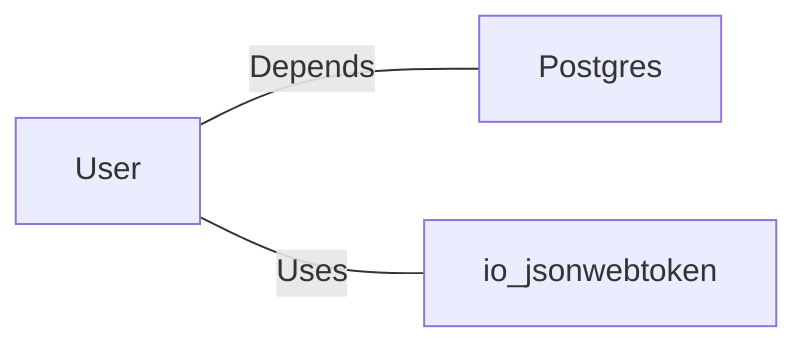

# User.java: User Management and Authentication

## Overview
This class provides functionalities for user management and authentication. It includes methods for generating JWT tokens, validating authentication, and fetching user details from a database. The class also demonstrates interaction with external dependencies such as a database and JWT library.

## Process Flow

```mermaid
flowchart TD
    Start("Start")
    CreateUser["User Constructor: Initialize User Object"]
    GenerateToken["token(): Generate JWT Token"]
    ValidateToken["assertAuth(): Validate JWT Token"]
    FetchUser["fetch(): Fetch User from Database"]
    End("End")

    Start --> CreateUser
    CreateUser --> GenerateToken
    CreateUser --> FetchUser
    GenerateToken --> End
    ValidateToken --> End
    FetchUser --> End
```

## Insights
- **JWT Token Generation**: The `token()` method generates a JWT token using the provided secret key and the user's username as the subject.
- **Authentication Validation**: The `assertAuth()` method validates a JWT token using the provided secret key. If validation fails, it throws an `Unauthorized` exception.
- **Database Interaction**: The `fetch()` method retrieves user details from a PostgreSQL database based on the username.
- **Potential SQL Injection Vulnerability**: The `fetch()` method constructs SQL queries using string concatenation, which is prone to SQL injection attacks.
- **Error Handling**: Exceptions are caught and printed, but the program continues execution, which may lead to unintended behavior.

## Dependencies

```mermaid
flowchart LR
    User --- |"Depends"| Postgres
    User --- |"Uses"| io_jsonwebtoken
```

- `Postgres`: Provides a connection to the PostgreSQL database. Used in the `fetch()` method to retrieve user details.
- `io.jsonwebtoken`: Used for JWT token generation and validation in the `token()` and `assertAuth()` methods.

## Data Manipulation (SQL)
### Table: `users`
| Attribute Name | Data Type | Description |
|----------------|-----------|-------------|
| user_id        | String    | Unique identifier for the user. |
| username       | String    | Username of the user. |
| password       | String    | Hashed password of the user. |

### SQL Command
- **Query**: `SELECT * FROM users WHERE username = '<username>' LIMIT 1`
  - **Operation**: SELECT
  - **Description**: Fetches user details based on the provided username.

## Vulnerabilities
1. **SQL Injection**:
   - The `fetch()` method constructs SQL queries using string concatenation, which is vulnerable to SQL injection attacks. Example: If `un` contains malicious SQL code, it could compromise the database.
   - **Mitigation**: Use prepared statements to safely parameterize SQL queries.

2. **Hardcoded Secret Key**:
   - The `token()` and `assertAuth()` methods rely on a secret key passed as a string. If the secret is not securely managed, it could lead to token forgery.
   - **Mitigation**: Store secrets securely using environment variables or a secrets management tool.

3. **Weak Error Handling**:
   - Exceptions are caught and printed but not properly logged or handled. This could expose sensitive information in logs and make debugging harder.
   - **Mitigation**: Implement robust error handling and logging mechanisms.

4. **Potential Resource Leak**:
   - The database connection is closed in the `fetch()` method, but the `Statement` object is not explicitly closed. This could lead to resource leaks.
   - **Mitigation**: Use try-with-resources or explicitly close all resources in a `finally` block.
