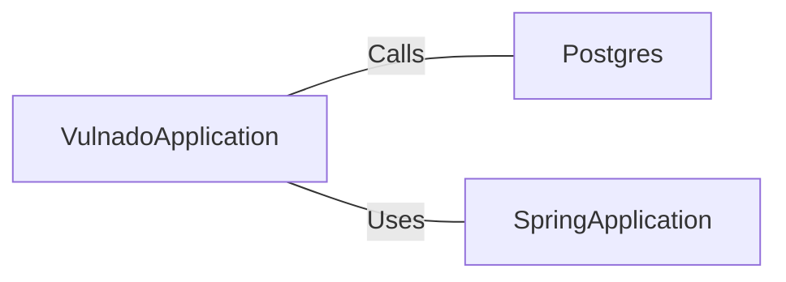

# VulnadoApplication.java: Main Application Entry Point

## Overview

This file serves as the main entry point for the `Vulnado` application. It initializes the Spring Boot application and sets up the PostgreSQL database connection. The application is configured to scan for servlet components.

## Process Flow

```mermaid
flowchart TD
    A[Start Application] --> B[Postgres.setup()]
    B --> C[SpringApplication.run(VulnadoApplication.class, args)]
    C --> D[Application Initialized]
```

## Insights

- The application uses Spring Boot's `@SpringBootApplication` annotation, which combines `@Configuration`, `@EnableAutoConfiguration`, and `@ComponentScan`.
- The `@ServletComponentScan` annotation enables scanning for servlet components, such as filters and listeners, within the application.
- The `Postgres.setup()` method is invoked before starting the Spring Boot application, indicating a custom database setup process.

## Dependencies



- `Postgres`: A custom class responsible for setting up the PostgreSQL database connection. The exact parameters and setup details are not provided in this file.
- `SpringApplication`: A Spring Boot utility class used to bootstrap and launch the application.

## Vulnerabilities

- **Potential Database Misconfiguration**: The `Postgres.setup()` method is invoked, but its implementation is not shown. If this method does not properly handle sensitive information (e.g., credentials) or validate inputs, it could lead to security vulnerabilities.
- **Servlet Component Exposure**: The use of `@ServletComponentScan` may expose servlets, filters, or listeners to external access. Ensure that only necessary components are exposed and that they are secured properly.
