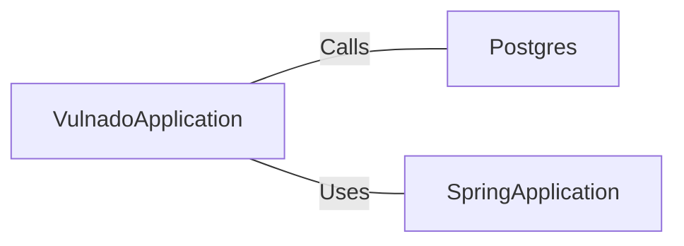

# VulnadoApplication.java: Main Application Entry Point

## Overview
This file serves as the main entry point for the `Vulnado` application. It initializes the Spring Boot application and sets up the PostgreSQL database connection.

## Process Flow
```mermaid
flowchart TD
    A[Start Application] --> B[Postgres.setup()]
    B --> C[SpringApplication.run(VulnadoApplication.class, args)]
    C --> D[Application Running]
```

## Insights
- The application uses Spring Boot for its framework.
- The `@SpringBootApplication` annotation enables auto-configuration, component scanning, and configuration properties.
- The `@ServletComponentScan` annotation allows scanning for servlet components such as filters and listeners.
- The `Postgres.setup()` method is invoked before starting the Spring Boot application, indicating a custom database setup process.

## Dependencies


- `Postgres`: A custom class or utility responsible for setting up the PostgreSQL database connection.
- `SpringApplication`: A Spring Boot utility class used to bootstrap and launch the application.

## Vulnerabilities
- **Hardcoded Database Setup**: The `Postgres.setup()` method is called directly in the `main` method. If this method contains sensitive information (e.g., credentials) or insecure configurations, it could lead to vulnerabilities.
- **Potential Lack of Input Validation**: If `Postgres.setup()` interacts with external inputs (e.g., environment variables or configuration files), ensure proper validation and sanitization to prevent injection attacks.
- **Servlet Scanning Risks**: The `@ServletComponentScan` annotation could inadvertently expose servlets, filters, or listeners that are not properly secured. Ensure all components are reviewed for security best practices.
