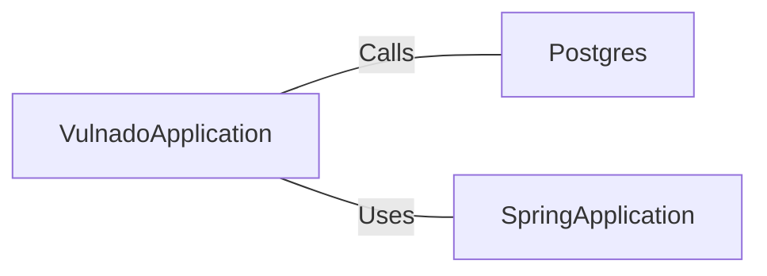

# VulnadoApplication.java: Main Application Entry Point

## Overview
This file serves as the main entry point for the `Vulnado` application. It initializes the Spring Boot application and sets up the PostgreSQL database connection.

## Process Flow
```mermaid
flowchart TD
    A[Start Application] --> B[Postgres.setup()]
    B --> C[SpringApplication.run(VulnadoApplication.class, args)]
    C --> D[Application Running]
```

## Insights
- The `@SpringBootApplication` annotation enables Spring Boot's auto-configuration and component scanning.
- The `@ServletComponentScan` annotation allows the application to scan for servlet components such as filters and listeners.
- The `Postgres.setup()` method is invoked before starting the Spring Boot application, indicating a custom database setup process.

## Dependencies


- `Postgres`: A custom class or utility responsible for setting up the PostgreSQL database connection.
- `SpringApplication`: A Spring Boot utility class used to bootstrap and launch the application.

## Vulnerabilities
- **Potential Database Misconfiguration**: The `Postgres.setup()` method is invoked, but its implementation is not shown. If this method does not handle database credentials securely (e.g., hardcoding credentials or improper encryption), it could lead to security vulnerabilities.
- **Servlet Component Exposure**: The `@ServletComponentScan` annotation enables scanning for servlet components. If improperly configured, it could expose sensitive endpoints or components to unauthorized access.
