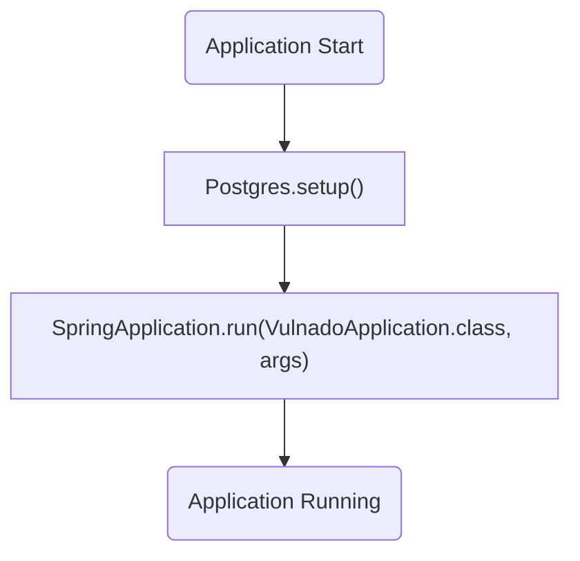
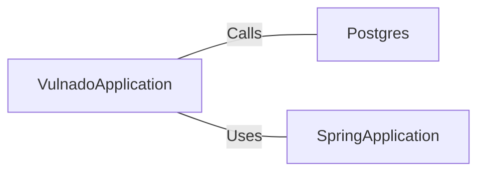

# VulnadoApplication.java: Spring Boot Application Entry Point

## Overview
This file serves as the entry point for the `Vulnado` application, a Spring Boot-based application. It initializes the application context and sets up necessary configurations, including database setup through the `Postgres.setup()` method.

## Process Flow

```mermaid
flowchart TD
    Start("Application Start") --> PostgresSetup["Postgres.setup()"]
    PostgresSetup --> SpringBootRun["SpringApplication.run(VulnadoApplication.class, args)"]
    SpringBootRun --> End("Application Running")
```

## Insights
- The `@SpringBootApplication` annotation marks this class as the main configuration class for the Spring Boot application.
- The `@ServletComponentScan` annotation enables scanning for servlet components, such as filters and listeners, within the application.
- The `Postgres.setup()` method is called before the Spring Boot application starts, indicating that database setup is a prerequisite for the application.
- The `SpringApplication.run()` method initializes the Spring Boot application context and starts the embedded server.

## Dependencies

```mermaid
flowchart LR
    VulnadoApplication --- |"Calls"| Postgres
    VulnadoApplication --- |"Uses"| SpringApplication
```

- `Postgres`: Responsible for setting up the database connection or configuration. The `setup()` method is explicitly called in the `main` method.
- `SpringApplication`: Used to bootstrap and launch the Spring Boot application.

## Vulnerabilities
- **Potential Database Misconfiguration**: The `Postgres.setup()` method is called without any validation or error handling in the provided code. If the database setup fails, it could lead to application startup issues.
- **Hardcoded Dependencies**: The explicit call to `Postgres.setup()` ties the application to a specific database setup logic, reducing flexibility and making it harder to switch to a different database or configuration.
- **Lack of Exception Handling**: The `main` method does not handle exceptions that might occur during `Postgres.setup()` or `SpringApplication.run()`. This could result in ungraceful application termination in case of errors.
